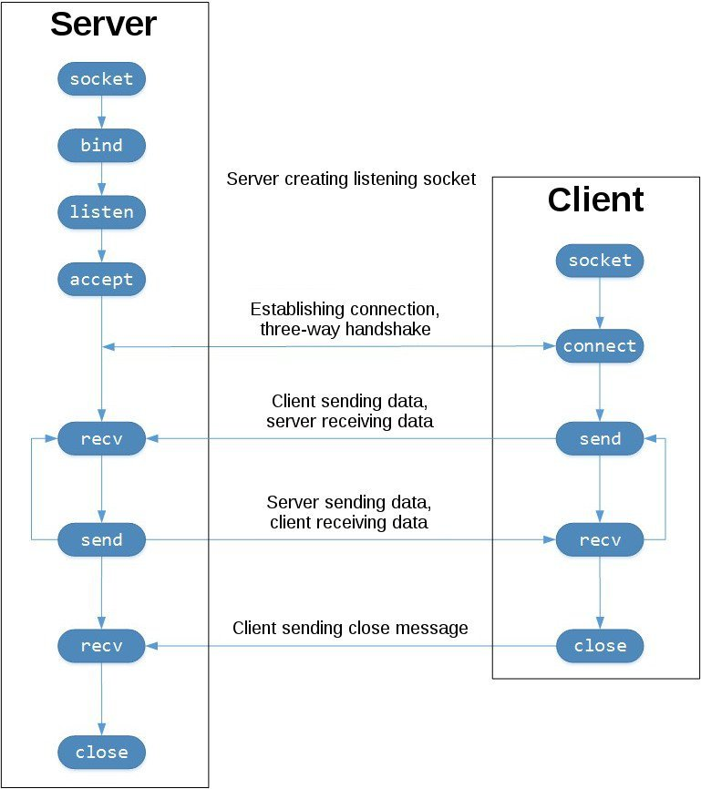

### TCP Port Scanner and OS detection
  - function: sends message through a socket and checks which ports are open, and also checks the operating system of the target
  - TCP structure in general: 
    
